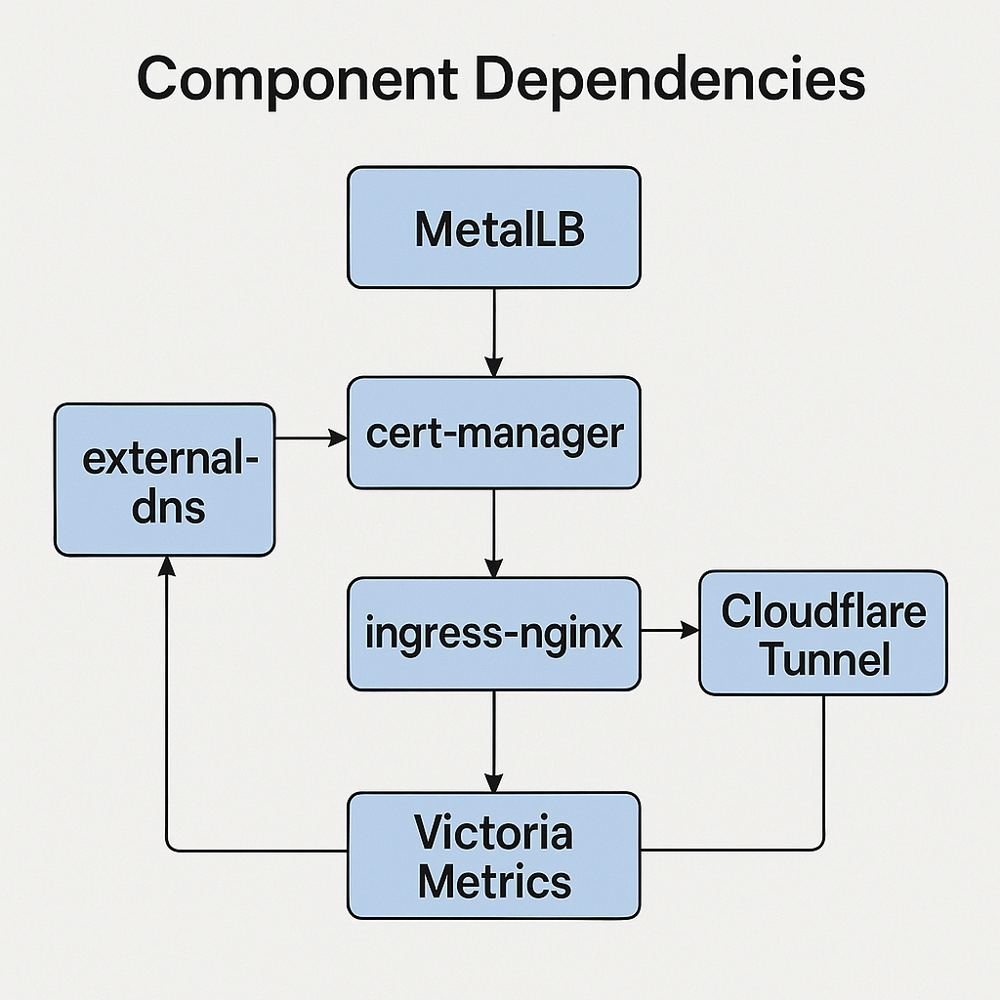

# Core Infrastructure Components

## Foundation for Platform Services

Core components provide essential platform capabilities that applications depend on:

- **MetalLB**: Load balancing without cloud provider
- **cert-manager**: Automated TLS certificate lifecycle
- **external-dns**: DNS record synchronization
- **ingress-nginx**: HTTP/HTTPS traffic routing
- **Cloudflare Tunnel**: Secure public access
- **Victoria Metrics**: Observability and monitoring

These components are deployed via **Helmfile** with explicit dependency ordering.

## Deployment Architecture



## Deployment Order

From `helmfile/helmfile.yaml`:

```yaml
helmfiles:
  - path: metallb-system/helmfile.yaml.gotmpl
  - path: secrets-system/helmfile.yaml.gotmpl
  - path: external-dns/helmfile.yaml.gotmpl
  - path: cert-manager/helmfile.yaml.gotmpl
  - path: ingress-nginx/helmfile.yaml.gotmpl
  - path: external-tunnel/helmfile.yaml.gotmpl
  - path: victoria-metrics/helmfile.yaml.gotmpl
  - path: argocd/helmfile.yaml.gotmpl
  - path: gitea/helmfile.yaml.gotmpl
  - path: cnpg-system/helmfile.yaml.gotmpl
  - path: metabase/helmfile.yaml.gotmpl
```

**Why this order**:
1. **MetalLB first**: Other services need LoadBalancer IPs
2. **Secrets next**: Components need secret management
3. **DNS before certs**: cert-manager uses DNS for challenges
4. **Certs before ingress**: Ingress needs TLS certificates
5. **Platform services last**: Depend on all above

## MetalLB: Bare Metal Load Balancing

### Purpose
Provides LoadBalancer-type Services without cloud provider integration.

### Configuration

**IP Pool** (from `helmfile/metallb-system/helmfile.yaml.gotmpl`):
```yaml
apiVersion: metallb.io/v1beta1
kind: IPAddressPool
metadata:
  name: default
  namespace: metallb-system
spec:
  addresses:
    - 192.168.77.200-192.168.77.254
```

**L2 Advertisement**:
```yaml
apiVersion: metallb.io/v1beta1
kind: L2Advertisement
metadata:
  name: default
  namespace: metallb-system
spec:
  ipAddressPools:
    - default
```

### IP Allocations

| Service | IP | Port | Purpose |
|---------|-----|------|---------|
| ingress-nginx-internal | 192.168.88.200 | 80, 443 | Internal HTTP/HTTPS |
| ingress-nginx-external | Auto | 80, 443 | Cloudflare Tunnel origin |
| gitea-ssh | Auto | 22 | Git SSH access |

### Why MetalLB?

**Alternatives considered**:
- ✅ **MetalLB** (chosen): Standard, mature, widely used
- ❌ **kube-vip**: More complex setup, fewer users
- ❌ **PureLB**: Newer, less proven
- ❌ **HAProxy external**: Not Kubernetes-native

## cert-manager: Certificate Lifecycle

### Purpose
Automates TLS certificate issuance, renewal, and rotation.

### Components

**1. cert-manager Core**:
```yaml
releases:
  - name: cert-manager
    namespace: cert-manager
    chart: jetstack/cert-manager
    version: 1.18.1
    values:
      - installCRDs: true
```

**2. trust-manager** (distributes CA certs):
```yaml
releases:
  - name: trust-manager
    namespace: cert-manager
    chart: jetstack/trust-manager
    version: 0.17.1
```

**3. Internal CA** (self-signed):
```yaml
apiVersion: cert-manager.io/v1
kind: ClusterIssuer
metadata:
  name: selfsigned-issuer
spec:
  selfSigned: {}
```

**4. Let's Encrypt Production**:
```yaml
apiVersion: cert-manager.io/v1
kind: ClusterIssuer
metadata:
  name: letsencrypt-prod
spec:
  acme:
    server: https://acme-v02.api.letsencrypt.org/directory
    email: oleksiy.pylypenko@gmail.com
    privateKeySecretRef:
      name: letsencrypt-prod
    solvers:
      - dns01:
          cloudflare:
            apiTokenSecretRef:
              name: cloudflare-api-token
              key: api-token
```

### Certificate Issuance

**Automatic via Ingress annotation**:
```yaml
apiVersion: networking.k8s.io/v1
kind: Ingress
metadata:
  name: gitea
  annotations:
    cert-manager.io/cluster-issuer: letsencrypt-prod
spec:
  tls:
    - hosts:
        - gitea.homelab.int.zengarden.space
      secretName: gitea-tls
  rules:
    - host: gitea.homelab.int.zengarden.space
```

**cert-manager automatically**:
1. Detects annotation
2. Creates Certificate resource
3. Initiates ACME challenge (DNS-01 via Cloudflare)
4. Stores cert in Secret `gitea-tls`
5. Renews before expiration

### Why cert-manager?

- Industry standard for Kubernetes
- Supports multiple issuers (Let's Encrypt, Vault, internal CA)
- Automatic renewal (no manual intervention)
- Works with Ingress, Gateway API, Istio

## external-dns: DNS Automation

### Purpose
Synchronizes Ingress/Service resources to DNS providers.

### Configuration

**MikroTik Provider** (from `helmfile/external-dns/helmfile.yaml.gotmpl`):
```yaml
provider:
  name: webhook
  webhook:
    image:
      repository: "ghcr.io/mirceanton/external-dns-provider-mikrotik"
      tag: "v1.4.4"
    env:
      - name: MIKROTIK_BASEURL
        value: http://mikrotik-proxy.homelab.int.zengarden.space
domainFilters:
  - homelab.int.zengarden.space
sources:
  - ingress
  - service
  - crd
extraArgs:
  - --managed-record-types=A
  - --managed-record-types=CNAME
  - --ingress-class=internal
```

### Workflow

**1. Create Ingress**:
```yaml
apiVersion: networking.k8s.io/v1
kind: Ingress
metadata:
  name: app
  annotations:
    external-dns.alpha.kubernetes.io/hostname: app.homelab.int.zengarden.space
spec:
  ingressClassName: internal
  rules:
    - host: app.homelab.int.zengarden.space
```

**2. external-dns detects** (polls every 5s):
```bash
# Reads Ingress resource
# Extracts hostname from annotation
# Gets LoadBalancer IP from ingress-nginx Service
```

**3. Creates DNS record** in MikroTik:
```
app.homelab.int.zengarden.space. 1800 IN A 192.168.88.200
```

**4. Cleanup on delete**:
```bash
kubectl delete ingress app
# external-dns removes DNS record automatically
```

### Restrictive Proxy Integration

**Why needed**: ExternalDNS requires MikroTik API access, but we don't want to expose admin password to cluster.

**Solution**: Restrictive HTTP proxy with path-based access control.

**Proxy configuration** (`ansible/install-restrictive-proxy/files/config.yaml`):
```yaml
proxy:
  mikrotik.homelab.int.zengarden.space:
    to:
      host: 192.168.1.1
      port: 80
      username: admin
      password: ${MIKROTIK_ADMIN_PASSWORD}
    mode: RESTRICT
    restrictions:
      GET:
        - "/rest/ip/dns/static/*"
      POST:
        - "/rest/ip/dns/static"
      PUT:
        - "/rest/ip/dns/static/*"
      DELETE:
        - "/rest/ip/dns/static/*"
```

**Security benefits**:
- ExternalDNS can only access DNS endpoints
- Cannot modify firewall, routing, or other settings
- Admin password not stored in Kubernetes

## ingress-nginx: Traffic Routing

### Two Ingress Controllers

#### Internal Ingress

**Purpose**: Home network and VPN access

**Configuration**:
```yaml
controller:
  ingressClassResource:
    name: internal
  service:
    type: LoadBalancer
    loadBalancerIP: 192.168.88.200
  tcp:
    22: "gitea/gitea-ssh:22"
```

**Features**:
- TLS termination with Let's Encrypt certs
- TCP passthrough for SSH (Gitea)
- NetworkPolicy: Allow from VLAN77, VLAN88, VPN

#### External Ingress

**Purpose**: Cloudflare Tunnel backend

**Configuration**:
```yaml
controller:
  ingressClassResource:
    name: external
  config:
    enable-modsecurity: "true"
    enable-owasp-modsecurity-crs: "true"
```

**Features**:
- ModSecurity WAF with OWASP CRS
- No public IP (Cloudflare Tunnel only)
- Rate limiting via Cloudflare

## Cloudflare Tunnel

### Purpose
Secure public access without exposing public IP or opening firewall ports.

### Architecture

```
Internet
  ↓
Cloudflare Edge
  ↓
Encrypted Tunnel (outbound connection from homelab)
  ↓
cloudflared pod
  ↓
ingress-nginx-external
  ↓
Application pods
```

### Configuration

```yaml
tunnel:
  hostname: "*.homelab.zengarden.space"
  service: http://ingress-nginx-external.ingress-nginx.svc.cluster.local:80
  originRequest:
    noTLSVerify: true
```

**Hostnames exposed**:
- `gitea.homelab.zengarden.space`
- `argocd.homelab.zengarden.space`

**Security**:
- No inbound firewall rules needed
- Cloudflare DDoS protection
- WAF (ModSecurity) on origin

## Victoria Metrics

### Purpose
Metrics collection, storage, and visualization.

### Components

**1. VictoriaMetrics Operator**:
```yaml
releases:
  - name: victoria-metrics-operator
    namespace: victoria-metrics
    chart: victoria-metrics/victoria-metrics-operator
```

**2. VMAgent** (Prometheus-compatible scraper)

**3. VMAlert** (alerting rules)

**4. AlertManager** (notification routing)

**5. Grafana** (visualization)

### Metrics Sources

**Node Exporter**:
```yaml
- Job: node-exporter
  Targets: All K3s nodes
  Metrics: CPU, memory, disk, network
```

**Kubernetes Metrics**:
```yaml
- Job: kube-state-metrics
  Metrics: Pod status, deployments, replica counts
```

**Application Metrics**:
```yaml
- Job: prometheus.io/scrape
  ServiceMonitor: Automatic discovery via annotations
```

### Alerting

**Integration with Gotify**:
```yaml
receivers:
  - name: gotify
    webhook_configs:
      - url: http://gotify.default.svc.cluster.local/message
        send_resolved: true
```

**Example alert**:
```yaml
groups:
  - name: nodes
    rules:
      - alert: NodeDown
        expr: up{job="node-exporter"} == 0
        for: 5m
        annotations:
          summary: "Node {{ $labels.instance }} is down"
```

## Component Health Monitoring

### Status Commands

```bash
# MetalLB
kubectl get ipaddresspool -n metallb-system
kubectl get svc -A --field-selector spec.type=LoadBalancer

# cert-manager
kubectl get certificates -A
kubectl get clusterissuers

# external-dns
kubectl logs -n external-dns deployment/external-dns
kubectl get ingress -A -o json | jq '.items[].metadata.annotations["external-dns.alpha.kubernetes.io/hostname"]'

# ingress-nginx
kubectl get ingressclass
kubectl get svc -n ingress-nginx

# Victoria Metrics
kubectl get vmagent -n victoria-metrics
kubectl get vmalert -n victoria-metrics
```

## Troubleshooting

### LoadBalancer stuck in Pending

**Symptom**:
```bash
kubectl get svc my-service
NAME         TYPE           EXTERNAL-IP   PORT(S)
my-service   LoadBalancer   <pending>     80:30123/TCP
```

**Cause**: MetalLB not running or IP pool exhausted

**Fix**:
```bash
# Check MetalLB
kubectl get pods -n metallb-system

# Check IP pool
kubectl describe ipaddresspool default -n metallb-system
```

### Certificate not issuing

**Symptom**:
```bash
kubectl get certificate gitea-tls
NAME        READY   AGE
gitea-tls   False   10m
```

**Cause**: ACME challenge failing (DNS-01)

**Fix**:
```bash
# Check challenge
kubectl describe challenge -A

# Check Cloudflare credentials
kubectl get secret cloudflare-api-token -n cert-manager

# Check cert-manager logs
kubectl logs -n cert-manager deployment/cert-manager
```

### DNS records not created

**Symptom**: Ingress created but DNS not resolving

**Cause**: external-dns can't access MikroTik

**Fix**:
```bash
# Check external-dns logs
kubectl logs -n external-dns deployment/external-dns

# Check MikroTik proxy
curl http://mikrotik-proxy.homelab.int.zengarden.space/rest/ip/dns/static

# Verify restrictive-proxy service
systemctl status restrictive-proxy  # on blade001/blade002
```

## Summary

Core components provide:

1. **Load Balancing**: MetalLB for bare metal
2. **TLS Automation**: cert-manager with Let's Encrypt
3. **DNS Automation**: external-dns with MikroTik
4. **Traffic Routing**: ingress-nginx (internal + external)
5. **Public Access**: Cloudflare Tunnel
6. **Observability**: Victoria Metrics stack

These create a **production-grade platform** for application delivery.
