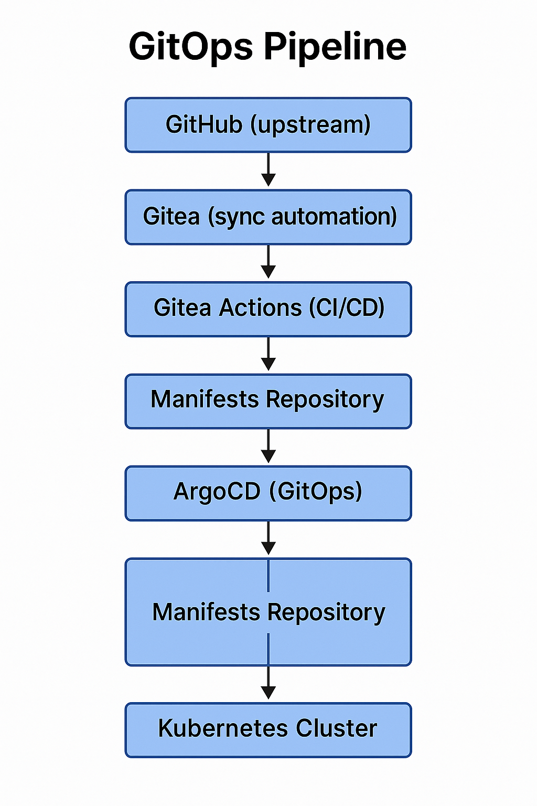

# GitOps Pipeline

## End-to-End Automated Deployment

The GitOps workflow automates the entire journey from **code commit** to **running application** through a fully self-hosted pipeline:



## Architecture Components

### 1. Gitea: Self-Hosted Git Server

**Purpose**: Internal Git server with GitHub synchronization

**Features**:
- **Git repositories**: Clone of GitHub organization
- **Container registry**: OCI-compliant image storage
- **Gitea Actions**: CI/CD runner (GitHub Actions compatible)
- **Webhooks**: Trigger ArgoCD sync on push

**Access**:
- **Internal**: https://gitea.homelab.int.zengarden.space
- **SSH**: ssh://git@gitea.homelab.int.zengarden.space:22

**Configuration** (from `helmfile/gitea/helmfile.yaml.gotmpl`):
```yaml
releases:
  - name: gitea
    namespace: gitea
    chart: gitea/gitea
    version: 12.4.0
    values:
      - replicas: 1
        persistence:
          size: 50Gi
        gitea:
          admin:
            username: {{ .Values.giteaAdminUsername }}
            password: {{ .Values.giteaAdminPassword }}
          config:
            server:
              DOMAIN: gitea.homelab.int.zengarden.space
              SSH_PORT: 22
            actions:
              ENABLED: true
```

### 2. Gitea Automation: Organizationync

**Purpose**: Mirror GitHub organization to internal Gitea

**Process**:
1. **Organization creation**: Detects/creates `zengarden-space` organization
2. **Repository sync**: Clones all repositories from GitHub
3. **Token management**: Generates PATs for Actions
4. **Webhook setup**: Configures push event triggers

**Implementation** (custom Helm chart):
```yaml
# helmfile/gitea/charts/gitea-automation/
├── templates/
│   ├── sync-job.yaml       # Periodic sync from GitHub
│   ├── rbac.yaml           # ServiceAccount permissions
│   └── secret.yaml         # GitHub token reference
├── files/
│   └── sync.sh             # Bash script for sync logic
└── values.yaml             # GitHub org, Gitea URL
```

**Sync Script** (`helmfile/gitea/charts/gitea-automation/files/sync.sh`):
```bash
#!/bin/bash
set -euo pipefail

GITHUB_ORG="zengarden-space"
GITEA_ORG="zengarden-space"
GITEA_URL="https://gitea.homelab.int.zengarden.space"

# Create organization if not exists
curl -X POST "$GITEA_URL/api/v1/orgs" \
  -H "Authorization: token $GITEA_TOKEN" \
  -d "{\"username\": \"$GITEA_ORG\"}"

# List GitHub repositories
REPOS=$(curl -s "https://api.github.com/orgs/$GITHUB_ORG/repos" | jq -r '.[].name')

for repo in $REPOS; do
  # Check if repo exists in Gitea
  if ! curl -sf "$GITEA_URL/api/v1/repos/$GITEA_ORG/$repo" &>/dev/null; then
    # Clone from GitHub and push to Gitea
    git clone "https://github.com/$GITHUB_ORG/$repo.git" "/tmp/$repo"
    cd "/tmp/$repo"
    git remote add gitea "$GITEA_URL/$GITEA_ORG/$repo.git"

    # Create repo in Gitea
    curl -X POST "$GITEA_URL/api/v1/orgs/$GITEA_ORG/repos" \
      -H "Authorization: token $GITEA_TOKEN" \
      -d "{\"name\": \"$repo\", \"private\": false}"

    git push gitea --all
    cd -
    rm -rf "/tmp/$repo"
  fi
done
```

### 3. Gitea Actions: CI/CD Runner

**Purpose**: Build containers and update manifests

**Workflow** (`.gitea/workflows/build.yaml` in each repository):
```yaml
name: Build and Push Container

on:
  push:
    branches: [main]

jobs:
  build:
    runs-on: ubuntu-latest
    steps:
      - name: Checkout code
        uses: actions/checkout@v3

      - name: Set up Docker Buildx
        uses: docker/setup-buildx-action@v2

      - name: Login to Gitea Container Registry
        uses: docker/login-action@v2
        with:
          registry: gitea.homelab.int.zengarden.space
          username: ${{ secrets.GITEA_USERNAME }}
          password: ${{ secrets.GITEA_PASSWORD }}

      - name: Build and push
        uses: docker/build-push-action@v4
        with:
          context: .
          push: true
          tags: |
            gitea.homelab.int.zengarden.space/zengarden-space/${{ github.repository }}:${{ github.sha }}
            gitea.homelab.int.zengarden.space/zengarden-space/${{ github.repository }}:latest

      - name: Update manifests repository
        run: |
          git clone https://gitea.homelab.int.zengarden.space/zengarden-space/manifests.git
          cd manifests
          sed -i "s|image: .*${{ github.repository }}:.*|image: gitea.homelab.int.zengarden.space/zengarden-space/${{ github.repository }}:${{ github.sha }}|" manifests/${{ github.repository }}/deployment.yaml
          git add .
          git commit -m "Update ${{ github.repository }} to ${{ github.sha }}"
          git push
```

**Result**: Container built, pushed to registry, manifest updated

### 4. ArgoCD: GitOps Orchestration

**Purpose**: Continuously sync Kubernetes state with Git

**Configuration** (from `helmfile/argocd/charts/argocd-config/values.yaml`):
```yaml
applications:
  - name: platform-apps
    project: default
    source:
      repoURL: https://gitea.homelab.int.zengarden.space/zengarden-space/manifests.git
      targetRevision: main
      path: manifests/*
    destination:
      server: https://kubernetes.default.svc
      namespace: default
    syncPolicy:
      automated:
        prune: true
        selfHeal: true
      syncOptions:
        - CreateNamespace=true
```

**ApplicationSet** (discovers all applications automatically):
```yaml
apiVersion: argoproj.io/v1alpha1
kind: ApplicationSet
metadata:
  name: platform-apps
spec:
  generators:
    - git:
        repoURL: https://gitea.homelab.int.zengarden.space/zengarden-space/manifests.git
        revision: main
        directories:
          - path: manifests/*
  template:
    metadata:
      name: '{{path.basename}}'
    spec:
      project: default
      source:
        repoURL: https://gitea.homelab.int.zengarden.space/zengarden-space/manifests.git
        targetRevision: main
        path: '{{path}}'
      destination:
        server: https://kubernetes.default.svc
      syncPolicy:
        automated:
          prune: true
          selfHeal: true
        syncOptions:
          - CreateNamespace=true
```

**Access**:
- **UI**: https://argocd.homelab.int.zengarden.space
- **Auth**: Google OIDC (admin: oleksiy.pylypenko@gmail.com)

## Complete Deployment Flow

### Step-by-Step Example

**1. Developer pushes code to GitHub**:
```bash
git commit -m "Add new feature"
git push origin main
```

**2. Gitea automation syncs** (runs every 5 minutes via CronJob):
```bash
# Detects new commit in GitHub
# Pulls changes to internal Gitea repository
```

**3. Gitea Actions triggers**:
```bash
# Webhook on push event
# Starts build workflow
# Builds Docker image
# Pushes to gitea.homelab.int.zengarden.space/zengarden-space/app:abc123
```

**4. Actions updates manifests**:
```bash
# Clones manifests repository
# Updates image tag to abc123
# Commits and pushes
```

**5. ArgoCD detects change** (polls every 3 minutes or webhook):
```bash
# Git repository changed
# Compares desired state (Git) vs actual state (cluster)
# Applies diff to cluster
```

**6. Application deployed**:
```bash
kubectl get pods -n app-namespace
# New pod with image gitea.homelab.int.zengarden.space/zengarden-space/app:abc123
```

## Rollback Procedure

### Git Revert Method

**1. Identify bad commit**:
```bash
cd manifests
git log --oneline
# abc123 Bad deployment
# def456 Previous good state
```

**2. Revert commit**:
```bash
git revert abc123
git push
```

**3. ArgoCD auto-syncs**:
```bash
# Detects revert
# Rolls back to previous image
```

### ArgoCD UI Method

**1. Access ArgoCD UI**:
```bash
open https://argocd.homelab.int.zengarden.space
```

**2. Select application → History tab**

**3. Click previous revision → Rollback**

**4. Confirm rollback**:
```bash
# ArgoCD reverts to selected revision
# Kubernetes resources updated
```

## Monitoring and Observability

### Gitea Metrics

**Prometheus metrics**:
```yaml
# Exposed on /metrics
gitea_organizations_total
gitea_repositories_total
gitea_actions_runs_total
gitea_actions_runs_duration_seconds
```

### ArgoCD Metrics

**Application Health**:
```bash
kubectl get applications -n argocd
NAME           SYNC STATUS   HEALTH STATUS
app1           Synced        Healthy
app2           OutOfSync     Degraded
```

**Sync Activity**:
```bash
# ArgoCD dashboard shows:
# - Last sync time
# - Sync duration
# - Number of resources
# - Sync errors
```

### Victoria Metrics Integration

**Dashboards**:
- Gitea repository activity
- Actions run success rate
- ArgoCD sync frequency
- Deployment lead time (commit → running)

## Security Considerations

### Secret Management

**Gitea Actions secrets**:
```bash
# Stored in Kubernetes Secret
kubectl create secret generic gitea-actions-secrets \
  --from-literal=GITEA_USERNAME=automation \
  --from-literal=GITEA_PASSWORD=xxx \
  -n gitea
```

**ArgoCD repository credentials**:
```yaml
apiVersion: v1
kind: Secret
metadata:
  name: gitea-repo-creds
  namespace: argocd
type: Opaque
stringData:
  username: argocd
  password: {{ .Values.argocdGiteaPassword }}
```

### RBAC

**ArgoCD Roles**:
```yaml
# Admin: oleksiy.pylypenko@gmail.com (Google OIDC)
# Read-only: Default for other authenticated users
policy.csv: |
  p, role:admin, applications, *, */*, allow
  p, role:admin, clusters, *, *, allow
  g, oleksiy.pylypenko@gmail.com, role:admin
```

**Gitea Permissions**:
- Organization owner: automation user
- Repository access: Team-based permissions
- Actions secrets: Repository admins only

## Troubleshooting

### Gitea sync not working

**Check automation job logs**:
```bash
kubectl logs -n gitea -l app.kubernetes.io/name=gitea-automation -f
```

**Common issues**:
- GitHub token expired → update secret
- Gitea API unreachable → check ingress/DNS
- Organization already exists → check ownership

### Actions not triggering

**Check webhooks**:
```bash
# Gitea UI → Repository → Settings → Webhooks
# Verify webhook URL and recent deliveries
```

**Check runner**:
```bash
kubectl logs -n gitea -l app=gitea-runner
```

### ArgoCD not syncing

**Check application status**:
```bash
kubectl describe application <name> -n argocd
```

**Common issues**:
- Repository credentials invalid → update secret
- Sync policy disabled → enable auto-sync
- Resource quota exceeded → check limits

## Best Practices

### 1. Branch Protection

**GitHub**:
- Require pull request reviews
- Require status checks (CI)
- No direct pushes to main

**Gitea**:
- Mirror branch protection from GitHub
- Prevent force pushes
- Require signed commits (optional)

### 2. Image Tagging Strategy

**Use commit SHA**:
```yaml
image: gitea.homelab.int.zengarden.space/app:abc123
# ✅ Immutable, traceable
```

**Avoid `latest`**:
```yaml
image: gitea.homelab.int.zengarden.space/app:latest
# ❌ Mutable, unclear what's deployed
```

### 3. Manifest Structure

**Separate application manifests**:
```
manifests/
├── app1/
│   ├── deployment.yaml
│   ├── service.yaml
│   └── ingress.yaml
├── app2/
│   ├── deployment.yaml
│   └── service.yaml
```

**ArgoCD discovers each directory as separate application**

### 4. Rollback Testing

**Regularly test rollback**:
```bash
# Deploy intentionally broken version
# Verify detection in ArgoCD
# Test rollback procedure
# Confirm application recovery
```

## Summary

The GitOps pipeline provides:

1. **Automation**: Code → Deployment with zero manual steps
2. **Traceability**: Every deployment traced to Git commit
3. **Rollback**: Git revert → automatic rollback
4. **Self-hosted**: No dependency on external CI/CD services
5. **Visibility**: Metrics and logs for entire pipeline

This creates a **production-grade deployment workflow** entirely within the homelab.
