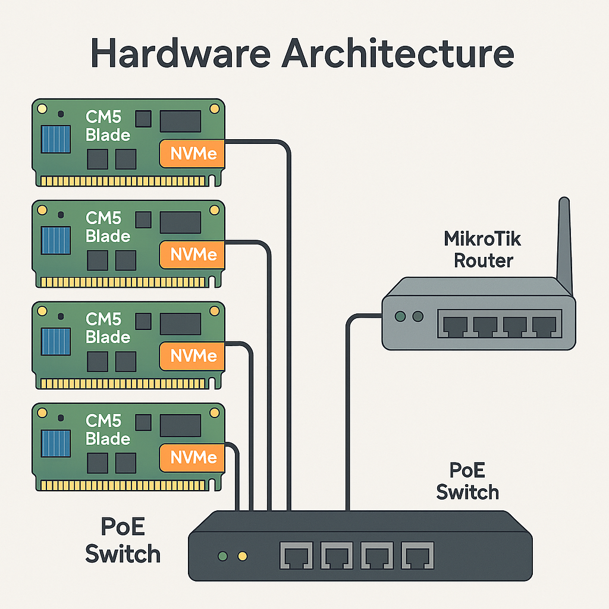

# Hardware Architecture

## Energy-Efficient Distributed Computing

This homelab is built on **Raspberry Pi Compute Module 5 (CM5)** blades, chosen for their unique combination of:

- **ARM64 performance** - 64-bit Cortex-A76 quad-core @ 2.4GHz
- **Low power consumption** - 2-5W per node typical, 7-10W with NVMe under load
- **Small form factor** - Compute blades with integrated PoE and NVMe
- **True distributed architecture** - 5 physical nodes, not VMs
- **Cost effectiveness** - ~$120-150 per blade fully configured


*Placeholder: Physical diagram showing CM5 blades, NVMe drives, PoE switch, and MikroTik router*

## Cluster Topology

### Node Configuration

| Hostname | IP Address | Role | RAM | Function |
|----------|-----------|------|-----|----------|
| **blade001** | 192.168.77.170 | Bootstrap Master | 16GB | Initial K3s master, etcd |
| **blade002** | 192.168.77.171 | Master | 16GB | K3s master, etcd |
| **blade003** | 192.168.77.172 | Master | 16GB | K3s master, etcd |
| **blade004** | 192.168.77.173 | Worker | 16GB | Workload execution |
| **blade005** | 192.168.77.174 | Worker | 8GB | Workload execution |

From `ansible/install-k3s/hosts.yaml`:

```yaml
bootstrapMaster:
  hosts:
    blade001:
      ansible_user: oleksiyp
      ansible_host: blade001

masters:
  hosts:
    blade002:
      ansible_user: oleksiyp
      ansible_host: blade002
    blade003:
      ansible_user: oleksiyp
      ansible_host: blade003

workers:
  hosts:
    blade004:
      ansible_user: oleksiyp
      ansible_host: blade004
    blade005:
      ansible_user: oleksiyp
      ansible_host: blade005

pies:
  vars:
    k3s_version: v1.32.4+k3s1
    domain: zengarden.space
```

### High Availability Design

**Control Plane**:
- 3 master nodes for quorum
- Distributed etcd (no external database)
- API server load balanced via MetalLB
- Leader election for controller-manager and scheduler

**Worker Plane**:
- 2 dedicated worker nodes
- Can scale horizontally by adding more blades
- Workload distribution via Kubernetes scheduler

## Hardware Specifications

### Compute Module 5 (CM5)

**Processor**:
- Broadcom BCM2712
- Quad-core ARM Cortex-A76 @ 2.4GHz
- 64-bit ARMv8.2-A architecture
- 512KB L2 cache per core
- 2MB shared L3 cache

**Memory**:
- 8GB or 16GB LPDDR4X-4267 SDRAM
- Soldered directly to module (not upgradable)
- Lower latency than SO-DIMM slots

**GPU**:
- VideoCore VII (not used for compute workloads)
- Useful for potential future media processing

**I/O**:
- PCIe 2.0 x1 for NVMe
- Gigabit Ethernet via carrier board
- USB 2.0/3.0 interfaces

### Storage: NVMe SSDs

**Interface**:
- PCIe 2.0 x1 (up to 500 MB/s theoretical)
- M.2 form factor (2230/2242/2260/2280)
- Hot-plug not supported (requires reboot)

**Initial Choice: Samsung High-End NVMe**
- ❌ **Problem**: Excessive heat generation
- ❌ **Impact**: Thermal throttling without active cooling
- ❌ **Cost**: Expensive for homelab use case

**Final Choice: Budget NVMe Drives**
- ✅ **Lower heat**: Simpler controllers, lower performance = less heat
- ✅ **Smaller form factor**: 2230/2242 easier to fit in compact chassis
- ✅ **Cost-effective**: ~$20-30 for 128-256GB
- ✅ **Sufficient performance**: 300-400 MB/s more than adequate for K3s

### Networking Hardware

**PoE+ Switch (Zyxel GS1200-5HPV2)**:
- 5× Gigabit Ethernet ports
- PoE+ (802.3at) on all ports
- 60W total PoE budget
- Powers blades 001-004
- VLAN support for network segmentation

**MikroTik Chateau LTE18 Router**:
- Gigabit Ethernet ports
- VLAN configuration capability
- Advanced firewall and routing
- DNS server functionality
- WireGuard VPN support
- LTE backup (future use)

**Uplink**:
- blade005 powered separately
- Gigabit Ethernet backbone
- Future: Consider 2.5G upgrade for higher throughput

### Power Delivery

**PoE+ (802.3at) Advantages**:
- Centralized power supply
- Single cable per blade (data + power)
- Reduces cable clutter
- Efficient voltage conversion
- Graceful power cycling

**Power Budget per Blade**:
- Idle: 2-3W
- Typical: 4-7W
- Peak with NVMe: 8-10W
- PoE+ provides up to 25.5W per port

**Total Cluster Power**:
- 5 nodes × 7W average = 35W typical
- Peak load: 40-50W with all NVMe active
- PoE switch overhead: ~5-10W
- **Total system**: ~40-60W under load

## Form Factor Advantages

### Compact Design
- No rack required
- Fits on desktop or shelf
- Minimal footprint (~30cm × 20cm)

### Silent Operation
- Silent fans on CM5
- PoE switch has quiet fan
- Whisper-quiet in office environment

### Portability
- Entire cluster in small box
- Easy to relocate
- Bring to conferences/meetups for demos

## Hardware Evolution

### Initial Investment
1. **CM5 modules**: Purchased with 8-16GB RAM variants
2. **High-end NVMe**: Samsung PRO series for performance
3. **PoE switch**: Zyxel for power delivery
4. **MikroTik router**: For advanced networking

### Iterative Improvements
1. **NVMe downgrade**: Switched to budget drives after heat issues
2. **Network tuning**: VLAN configuration for isolation
3. **Firmware updates**: Keep CM5 bootloader current

## Cost Breakdown

| Component | Quantity | Unit Cost | Total |
|-----------|----------|-----------|-------|
| CM5 (8/16GB) | 5 | $80-120 | $400-600 |
| NVMe SSD (256GB) | 5 | $20-30 | $100-150 |
| PoE+ Switch | 1 | $150-200 | $150-200 |
| MikroTik Router | 1 | $150-250 | $150-250 |
| Cables/Misc | - | - | $50-100 |
| **Total** | | | **$850-1,300** |

### Cloud Equivalent

For similar compute capacity:
- **AWS**: 5× t4g.medium (2vCPU, 4GB) = ~$150/month
- **GCP**: 5× e2-medium (2vCPU, 4GB) = ~$120/month
- **Azure**: 5× B2s (2vCPU, 4GB) = ~$130/month

**Break-even**: ~6-9 months vs cloud

## Future Upgrades

### Potential Enhancements
1. **Storage**: Add Ceph/Rook for distributed storage
2. **Networking**: Upgrade to 2.5G Ethernet for higher throughput
3. **Nodes**: Add more CM5 blades for horizontal scaling
4. **GPU**: Add Coral TPU or GPU for ML workloads
5. **Backup**: External NAS for cluster backup

### Scalability Limits
- **PoE budget**: Current switch supports 4 blades, need additional switch for more
- **Network bandwidth**: 1Gbps shared uplink may bottleneck with >5 nodes
- **Power**: 60W PoE budget limits total blade count
- **Thermal**: Compact layout limits passive cooling efficiency

## Comparison with Alternatives

### vs x86 Mini PCs (NUC, Beelink, etc.)

| Aspect | CM5 Blades | x86 Mini PCs |
|--------|-----------|--------------|
| Power | 4-7W | 15-45W |
| Cost/node | $100-120 | $200-400 |
| Form factor | Very compact | Larger |
| Heat | Minimal | Requires active cooling |
| Architecture | ARM64 | x86_64 |
| ARM native | Yes | Emulation/translation |

**Why CM5**: Lower power, lower cost, ARM-native for modern cloud workloads

### vs Cloud VMs

| Aspect | CM5 Homelab | Cloud VMs |
|--------|-------------|-----------|
| Monthly cost | $4 power | $120-200 |
| Initial cost | $850-1,300 | $0 |
| Control | Full hardware access | Limited |
| Networking | Real physical network | Virtual/abstracted |
| Experimentation | Free to break | Costs money |

**Why Homelab**: Long-term cost, learning value, complete control

### vs Single Server

| Aspect | 5-node CM5 | Single Powerful Server |
|--------|-----------|----------------------|
| Distributed | Real multi-node | Simulated |
| Failure modes | Actual node failures | Doesn't test HA |
| Power | 40W total | 100-200W |
| Cost | $850-1,300 | $800-2,000 |
| Scalability | Add nodes easily | Limited by single chassis |

**Why Multi-node**: Real distributed systems experience, true HA testing

## Summary

The hardware foundation of this homelab prioritizes:

1. **Energy efficiency**: 40W total for 5-node cluster
2. **Cost effectiveness**: &lt;$1,300 initial, $4/month operational
3. **Real distribution**: Actual multi-node cluster, not VMs
4. **Learning platform**: ARM64 architecture, modern cloud-native patterns
5. **Production patterns**: HA setup, distributed storage, real networking

This combination creates a true production-like environment at homelab scale and cost.
