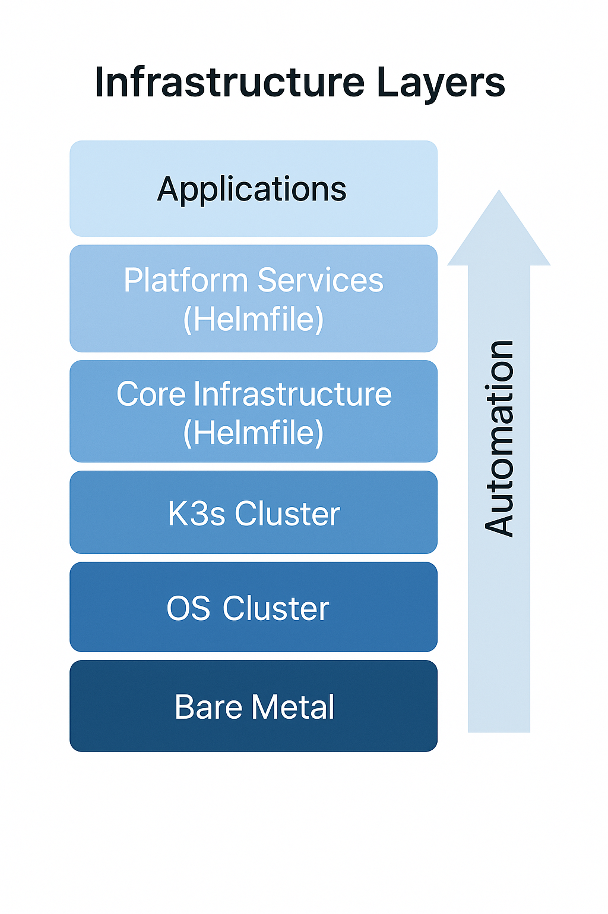

# Infrastructure Automation

## Bare Metal to Kubernetes

Infrastructure automation bridges the gap between **bare hardware** and **running Kubernetes cluster** through:

1. **NVMe Partitioning** - Prepare persistent storage
2. **K3s Installation** - Bootstrap Kubernetes cluster
3. **Security Hardening** - Pod Security Admissions, audit logging, RBAC
4. **Restrictive Proxy** - Security boundary for external service access

All automation is implemented as **Ansible playbooks** for reproducibility and auditability.

## Automation Layers



### Layer 1: Bare Metal (Ansible)

**What runs here**:
- NVMe drive partitioning and formatting
- Filesystem mounts configuration
- Kernel parameter tuning
- K3s binary installation
- Restrictive HTTP proxy setup

**Why not Kubernetes**: Can't bootstrap Kubernetes from within Kubernetes

### Layer 2: K3s Cluster

**What runs here**:
- Kubernetes API server
- Controller manager
- Scheduler
- Kubelet on each node
- etcd (distributed across masters)

**Why K3s**: Lightweight, single-binary, optimized for edge/ARM64

### Layer 3: Core Infrastructure (Helmfile)

**What runs here**:
- MetalLB (load balancing)
- cert-manager (TLS certificates)
- external-dns (DNS automation)
- ingress-nginx (HTTP routing)
- External Secrets Operator
- DerivedSecrets Operator

**Why Helmfile**: Declarative ordering, environment separation, GitOps-friendly

### Layer 4: Platform Services (Helmfile)

**What runs here**:
- ArgoCD (GitOps orchestration)
- Gitea (Git server)
- Victoria Metrics (monitoring)
- CloudNativePG (PostgreSQL operator)
- Metabase (analytics)

**Why separate layer**: Depends on core infrastructure (ingress, certs, secrets)

### Layer 5: Applications (ArgoCD)

**What runs here**:
- User-facing applications
- Pet projects
- Experimental workloads

**Why ArgoCD**: Automatic sync from Git, no manual kubectl apply

## Deployment Sequence

### Step 1: Partition NVMe Drives

```bash
cd ansible/partition-nvme-drives
./install.sh
```

**What it does**:
- Creates ext4 filesystem on `/dev/nvme0n1`
- Mounts to `/var/lib/rancher/k3s`
- Adds to `/etc/fstab` for persistence
- Sets filesystem label `k3s-data`

**Why needed**: K3s stores etcd data, container images, and volumes on local disk

### Step 2: Install K3s Cluster

```bash
cd ansible/install-k3s
cp .env.template .env
# Edit .env with K3s token and Cilium configuration
./install.sh
```

**What it does**:
- Sets kernel parameters (cgroups, overcommit, panic handling)
- Installs K3s binary on all nodes
- Bootstraps first master (blade001)
- Joins additional masters (blade002, blade003)
- Joins workers (blade004, blade005)
- Configures Cilium CNI
- Applies security hardening (PSA, audit logs)

**Result**: Running 5-node Kubernetes cluster with 3 masters, 2 workers

### Step 3: Install Restrictive Proxy (Optional)

```bash
cd ansible/install-restrictive-proxy
cp .env.template .env
# Edit .env with MIKROTIK_ADMIN_PASSWORD
./install.sh
```

**What it does**:
- Installs Node.js proxy service on blade001-002
- Configures path-based access control to MikroTik
- Creates systemd service for automatic startup
- Restricts API calls to safe endpoints only

**Why needed**: ExternalDNS needs MikroTik API access without exposing admin password to cluster

### Step 4: Deploy Core Infrastructure

```bash
cd helmfile
for component in metallb-system cert-manager external-dns secrets-system ingress-nginx; do
  cp $component/env.yaml.template $component/env.yaml
  # Edit with actual secrets
done
helmfile apply
```

**What it does**:
- Deploys infrastructure components in dependency order
- Creates LoadBalancer IP pool (MetalLB)
- Configures Let's Encrypt certificate issuers
- Sets up DNS synchronization to MikroTik
- Installs DerivedSecrets operator
- Deploys ingress controllers (internal + external)

**Result**: Platform ready for application deployment

### Step 5: Deploy Platform Services

```bash
cd helmfile
helmfile -l name=argocd apply
helmfile -l name=gitea apply
helmfile -l name=victoria-metrics apply
```

**What it does**:
- Installs ArgoCD for GitOps
- Deploys Gitea with PostgreSQL and Valkey
- Sets up metrics collection and Grafana

**Result**: Self-hosted Git server, CI/CD, and observability

### Step 6: Initialize GitOps

```bash
# Gitea automation creates organization and syncs from GitHub
kubectl logs -n gitea -l app.kubernetes.io/name=gitea-automation -f

# ArgoCD ApplicationSet discovers manifests repository
kubectl get applications -n argocd
```

**What it does**:
- Gitea automation clones repositories from GitHub
- Gitea Actions trigger on push events
- Build containers and push to registry
- Update manifests repository
- ArgoCD detects changes and deploys

**Result**: Fully automated GitOps pipeline from code to deployment

## File Structure

```
ansible/
├── partition-nvme-drives/
│   ├── install.sh           # Run playbook
│   └── partition.yaml       # Ansible tasks
├── install-k3s/
│   ├── hosts.yaml           # Node inventory
│   ├── install.yaml         # Installation playbook
│   ├── .env                 # K3s configuration (gitignored)
│   └── files/
│       ├── k3s-server.yaml  # Server configuration
│       └── audit.yaml       # Audit log policy
└── install-restrictive-proxy/
    ├── install.yaml         # Proxy installation
    ├── hosts.yaml           # Deployment targets
    ├── .env                 # Admin password (gitignored)
    └── files/
        ├── proxy.js         # Node.js proxy server
        └── config.yaml      # Path restrictions
```

## Configuration Management

### Environment Files (.env)

Each component has `env.yaml` or `.env` for secrets:

**Pattern**:
```bash
# Template (checked into Git)
cp env.yaml.template env.yaml

# Edit with actual values (gitignored)
vim env.yaml
```

**Examples**:
- `ansible/install-k3s/.env`: K3s cluster token, Cilium settings
- `helmfile/cert-manager/env.yaml`: Cloudflare API token
- `helmfile/gitea/env.yaml`: Admin password, GitHub token
- `helmfile/secrets-system/env.yaml`: Master password for DerivedSecrets

### Why Not HashiCorp Vault?

**Considered alternatives**:
- ✅ **DerivedSecrets** (chosen): Deterministic, no external dependencies, GitOps-friendly
- ❌ **Vault**: Requires running Vault cluster, unsealing complexity, not deterministic
- ❌ **Sealed Secrets**: Requires backup of sealing key, rotation complexity
- ❌ **SOPS**: Better for static secrets, not dynamic generation

## Observability

### Ansible Playbook Logs

**During execution**:
```bash
cd ansible/install-k3s
./install.sh 2>&1 | tee install.log
```

**Logs saved**: `install.log` contains full output for debugging

### K3s Installation Verification

```bash
# Check K3s service status
ansible -i hosts.yaml pies -m shell -a "systemctl status k3s" -b

# Get node status
kubectl get nodes
```

### Component Health

```bash
# Check critical pods
kubectl get pods -n kube-system
kubectl get pods -n metallb-system
kubectl get pods -n cert-manager
kubectl get pods -n external-dns
```

## Troubleshooting

### Common Issues

**NVMe not mounted**:
```bash
# Check mount
ansible -i ansible/partition-nvme-drives/hosts.yaml pies -m shell -a "mount | grep k3s"

# Re-run partitioning
cd ansible/partition-nvme-drives && ./install.sh
```

**K3s service failing**:
```bash
# Check logs
ansible -i ansible/install-k3s/hosts.yaml blade001 -m shell -a "journalctl -u k3s -n 100"

# Common causes:
# - NVMe not mounted → check /var/lib/rancher/k3s
# - Cluster token mismatch → verify .env file
# - Network connectivity → ping other nodes
```

**Pod Security Admission blocking**:
```bash
# Check pod events
kubectl describe pod <pod-name>

# Look for:
# "violates PodSecurity" → pod needs security context adjustments

# Add to namespace exemptions in install.yaml:66
exemptions:
  namespaces: [kube-system, rook-ceph, your-namespace]
```

## Security Considerations

### Principle of Least Privilege

**Ansible SSH Access**:
- Uses user `oleksiyp` with sudo
- SSH key authentication only
- No password authentication

**K3s API Access**:
- Kubeconfig restricted to admin users
- RBAC for service accounts
- OIDC for human users (Google)

**Secrets**:
- Never committed to Git
- Stored in `.env` / `env.yaml` (gitignored)
- Encrypted at rest in etcd
- Derived from master password when possible

### Audit Trail

**Infrastructure Changes**:
- Ansible playbooks in Git (who changed what)
- Helmfile releases tracked (version history)
- ArgoCD sync history (deployment timeline)

**API Activity**:
- K3s audit logs in `/var/lib/rancher/k3s/server/logs/audit.log`
- 30-day retention
- JSON format for parsing

## Summary

Infrastructure automation achieves:

1. **Reproducibility**: Rebuild cluster from playbooks
2. **Security**: Hardening built-in from day one
3. **Observability**: Logs and metrics from the start
4. **Maintainability**: Clear separation of concerns
5. **Documentation**: Code as authoritative reference

The result is a **production-grade platform** ready for application deployment.
