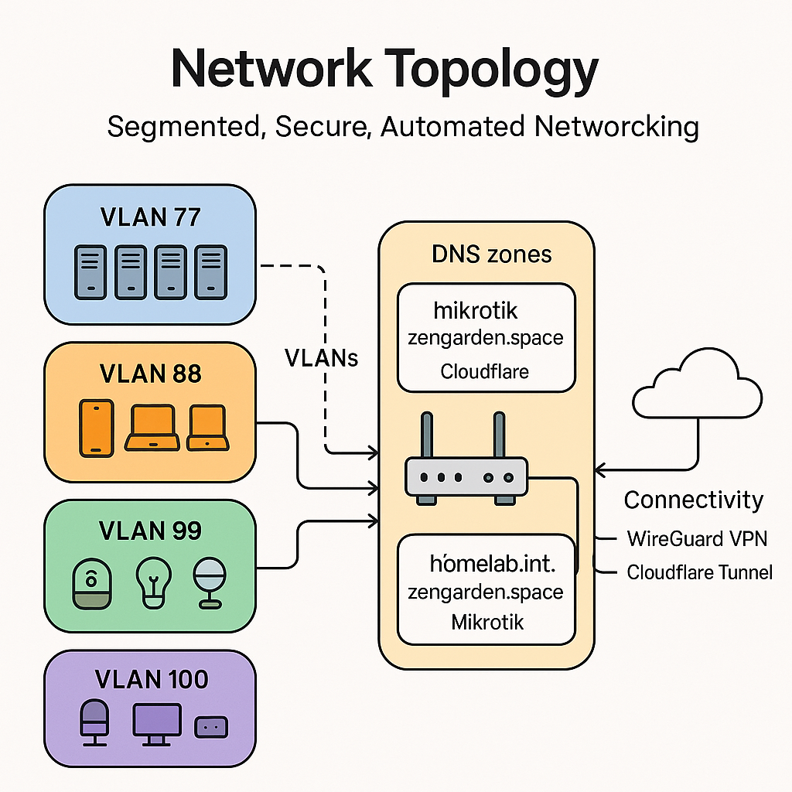

# Network Architecture

## Segmented, Secure, Automated Networking

The network design separates concerns through **VLAN isolation**, automates DNS management, and provides secure external access via **WireGuard VPN** and **Cloudflare Tunnel**.


*Placeholder: Network diagram showing VLANs, MikroTik router, DNS zones, and connectivity*

## Network Segmentation

### VLAN Strategy

| VLAN ID | Network | Purpose | Access Control |
|---------|---------|---------|----------------|
| **77** | 192.168.77.0/24 | K3s Cluster | Isolated from home network |
| **88** | 192.168.88.0/24 | Home Network | WiFi, personal devices |
| **99** | 192.168.99.0/24 | IoT Network | Smart home devices |
| **100** | 192.168.100.0/24 | Management | Admin-only access |

### VLAN 77: Kubernetes Cluster

**Purpose**: Dedicated network for Kubernetes nodes and pods

**IP Allocations**:
- **Nodes**: 192.168.77.170-175 (blade001-blade005)
- **Gateway**: 192.168.77.1 (MikroTik)
- **MetalLB Pool**: 192.168.77.200-254

**Kubernetes Networks**:
- **Pod CIDR**: 10.42.0.0/16 (Cilium-managed)
- **Service CIDR**: 10.43.0.0/16 (ClusterIP services)

**Firewall Rules**:
```
# Allow VPN → VLAN77
ACCEPT: 10.8.0.0/24 → 192.168.77.0/24

# Allow VPN → Pod network
ACCEPT: 10.8.0.0/24 → 10.42.0.0/16

# Allow VPN → Service network
ACCEPT: 10.8.0.0/24 → 10.43.0.0/16

# Block VLAN77 → Home network
REJECT: 192.168.77.0/24 → 192.168.88.0/24

# Block VLAN77 → Management
REJECT: 192.168.77.0/24 → 192.168.100.0/24
```

### VLAN 88: Home Network

**Purpose**: Personal devices (laptops, phones, tablets)

**Access**:
- Internet via MikroTik NAT
- Internal services via ingress (192.168.88.200)
- Blocked from direct cluster access

### VLAN 99: IoT Network

**Purpose**: Smart home devices (HomeAssistant, sensors, cameras)

**Isolation**:
- No access to cluster VLAN
- Limited internet access (specific domains only)
- HomeAssistant in DMZ for control

### VLAN 100: Management

**Purpose**: Administrative access to all networks

**Security**:
- Physical connection required or VPN
- Access to MikroTik admin interface
- Full cluster API access
- Network monitoring tools

## DNS Architecture

### Three-Zone Strategy

#### 1. Public Production: `zengarden.space`

**Provider**: Cloudflare DNS
**Writer**: ExternalDNS (Cloudflare provider)
**Ingress IP**: 203.0.113.10 (Oracle Cloud public IP)

**Purpose**: Production applications deployed to Oracle Cloud

**Example Records**:
- `app.zengarden.space` → Oracle Cloud application
- `api.zengarden.space` → Production API server

#### 2. Public Homelab: `homelab.zengarden.space`

**Provider**: Cloudflare DNS
**Writer**: Cloudflare Tunnel (cloudflared)
**Ingress**: Via encrypted tunnel, no public IP exposure

**Purpose**: Selected homelab services exposed publicly via secure tunnel

**Example Records**:
- `gitea.homelab.zengarden.space` → Gitea (via tunnel)
- `argocd.homelab.zengarden.space` → ArgoCD (via tunnel)

**Security**:
- No inbound firewall rules needed
- mTLS encryption in tunnel
- DDoS protection via Cloudflare

#### 3. Internal Homelab: `homelab.int.zengarden.space`

**Provider**: MikroTik DNS
**Writer**: ExternalDNS (MikroTik webhook provider)
**Ingress IP**: 192.168.88.200 (MetalLB internal ingress)

**Purpose**: All internal services accessible via home network or VPN

**Example Records**:
- `gitea.homelab.int.zengarden.space` → 192.168.88.200
- `argocd.homelab.int.zengarden.space` → 192.168.88.200
- `grafana.homelab.int.zengarden.space` → 192.168.88.200

From `helmfile/external-dns/helmfile.yaml.gotmpl`:

```yaml
releases:
  - name: external-dns
    namespace: external-dns
    chart: external-dns/external-dns
    version: 1.15.0
    values:
      - interval: 5s
        sources:
          - ingress
          - service
          - crd
        domainFilters:
          - homelab.int.zengarden.space
        provider:
          name: webhook
          webhook:
            image:
              repository: "ghcr.io/mirceanton/external-dns-provider-mikrotik"
              tag: "v1.4.4"
            env:
              - name: MIKROTIK_BASEURL
                value: http://mikrotik-proxy.homelab.int.zengarden.space
        extraArgs:
          - --managed-record-types=A
          - --managed-record-types=CNAME
          - --ingress-class=internal
```

### DNS Resolution Flow

**Internal Clients (Home Network)**:
```
Client query: gitea.homelab.int.zengarden.space
  ↓
MikroTik DNS (192.168.77.1)
  ↓
Returns: 192.168.88.200 (MetalLB ingress)
  ↓
ingress-nginx routes to Gitea pod
```

**External Clients (Internet)**:
```
Client query: gitea.homelab.zengarden.space
  ↓
Cloudflare DNS
  ↓
Returns: Cloudflare proxy IP
  ↓
Cloudflare Tunnel terminates connection
  ↓
Encrypted tunnel to homelab
  ↓
ingress-nginx routes to Gitea pod
```

## Ingress Strategy

### Two Ingress Controllers

#### Internal Ingress (`ingress-nginx-internal`)

**Purpose**: Services accessible from home network + VPN

**Configuration**:
- IngressClass: `internal`
- MetalLB IP: 192.168.88.200
- DNS: `*.homelab.int.zengarden.space`
- TLS: Let's Encrypt certificates
- NetworkPolicy: Restricted to VLAN77, VLAN88, VPN

**Special Features**:
```yaml
tcp:
  22: "gitea/gitea-ssh:22"  # SSH passthrough for Git operations
```

#### External Ingress (`ingress-nginx-external`)

**Purpose**: Services exposed to internet via Cloudflare Tunnel

**Configuration**:
- IngressClass: `external`
- Tunnel endpoint only (no public IP)
- DNS: `*.homelab.zengarden.space`
- TLS: Cloudflare-managed
- ModSecurity: OWASP CRS enabled
- Rate limiting: Cloudflare DDoS protection

## VPN Access

### WireGuard Configuration

**Interface**: `wireguard-vpn`
**Network**: 10.8.0.0/24
**Server IP**: Public IP of homelab (or dynamic DNS)
**Port**: 51820/UDP

**Client Configuration**:
```ini
[Interface]
PrivateKey = <client-private-key>
Address = 10.8.0.2/32
DNS = 192.168.77.1

[Peer]
PublicKey = <server-public-key>
Endpoint = <homelab-public-ip>:51820
AllowedIPs = 192.168.77.0/24, 10.42.0.0/16, 10.43.0.0/16
PersistentKeepalive = 25
```

**Access Granted**:
- K3s nodes (192.168.77.0/24)
- Pod network (10.42.0.0/16) for direct pod access
- Service network (10.43.0.0/16) for ClusterIP access
- Internal DNS (192.168.77.1)

**Access Denied**:
- Home network (192.168.88.0/24) for privacy
- Management VLAN (192.168.100.0/24) for security
- IoT network (192.168.99.0/24)

### VPN Use Cases

**Remote Administration**:
```bash
# Connect via VPN
wg-quick up homelab

# Access cluster
export KUBECONFIG=~/.kube/homelab
kubectl get nodes

# Access web UIs
open https://argocd.homelab.int.zengarden.space
```

**Collaboration** (Planned):
- Grant colleague temporary VPN access
- They can access internal services
- Collaborate on Gitea repositories
- Share development environment

## Network Security

### Firewall Strategy

**Default Policy**: DENY all, ALLOW specific

**MikroTik Firewall Rules** (simplified):
```
# Allow established/related
ACCEPT: state=established,related

# Allow ICMP (ping, traceroute)
ACCEPT: protocol=icmp

# VPN access to cluster
ACCEPT: src=10.8.0.0/24 dst=192.168.77.0/24

# Block cluster → home
REJECT: src=192.168.77.0/24 dst=192.168.88.0/24

# Block cluster → management
REJECT: src=192.168.77.0/24 dst=192.168.100.0/24

# Default deny
DROP: all
```

### Network Policies (Cilium)

**Namespace Isolation**:
```yaml
apiVersion: cilium.io/v2
kind:CiliumNetworkPolicy
metadata:
  name: default-deny
spec:
  endpointSelector: {}
  ingress:
    - fromEndpoints:
      - matchLabels:
          k8s:io.kubernetes.pod.namespace: same-namespace
```

**Ingress-Only Access**:
```yaml
apiVersion: cilium.io/v2
kind: CiliumNetworkPolicy
metadata:
  name: allow-ingress
spec:
  endpointSelector:
    matchLabels:
      app: web-app
  ingress:
    - fromEndpoints:
      - matchLabels:
          app.kubernetes.io/name: ingress-nginx
```

## Load Balancing

### MetalLB Configuration

**IP Pool**: 192.168.77.200-254

**Address Assignment**:
```yaml
apiVersion: metallb.io/v1beta1
kind: IPAddressPool
metadata:
  name: default
  namespace: metallb-system
spec:
  addresses:
    - 192.168.77.200-192.168.77.254
```

**Service Allocations**:
- **192.168.88.200**: Internal ingress-nginx (announced to VLAN88 via BGP or L2)
- **192.168.77.201**: ArgoCD server (optional direct access)
- **192.168.77.202**: Gitea SSH (port 22 passthrough)
- Auto-assigned IPs for other LoadBalancer services

## Network Performance

### Bandwidth Characteristics

**Physical Limits**:
- Gigabit Ethernet: 1000 Mbps
- PCIe 2.0 x1 to NVMe: ~4 Gbps (500 MB/s)
- PoE+ power delivery: 25.5W per port

**Observed Throughput**:
- Node-to-node: ~940 Mbps (line rate)
- Pod-to-pod (same node): ~2-5 Gbps (localhost)
- Pod-to-pod (different node): ~900 Mbps (via Cilium)
- Ingress → Backend: ~700-800 Mbps (TLS overhead)

**Latency**:
- Pod-to-pod (same node): &lt;0.1ms
- Pod-to-pod (different node): 0.2-0.5ms
- External → Ingress: 1-5ms (local network)

### Future Optimization

**Potential Upgrades**:
1. **2.5G Ethernet**: 2.5× throughput increase
2. **PCIe 3.0**: If CM6 supports faster NVMe
3. **10G backbone**: For inter-node storage traffic (Ceph/Rook)

## Troubleshooting

### Common Issues

**DNS not resolving**:
```bash
# Check external-dns logs
kubectl logs -n external-dns deployment/external-dns

# Verify MikroTik DNS records
# Access MikroTik WebFig → IP → DNS → Static
```

**Ingress not accessible**:
```bash
# Check MetalLB IP assignment
kubectl get svc -n ingress-nginx

# Verify ingress configuration
kubectl get ingress -A

# Test from VPN client
curl -v https://argocd.homelab.int.zengarden.space
```

**VPN connection fails**:
```bash
# Check WireGuard status
wg show

# Verify firewall allows UDP 51820
# Check MikroTik → IP → Firewall → Filter Rules
```

## Summary

The network architecture provides:

1. **Isolation**: VLANs separate cluster, home, IoT, and management
2. **Automation**: ExternalDNS syncs ingress to MikroTik/Cloudflare
3. **Security**: Firewall rules, network policies, VPN-only external access
4. **Flexibility**: Multiple ingress controllers for internal/external routing
5. **Performance**: Gigabit throughout, low latency pod networking

This foundation enables secure, scalable service delivery from homelab to production.
